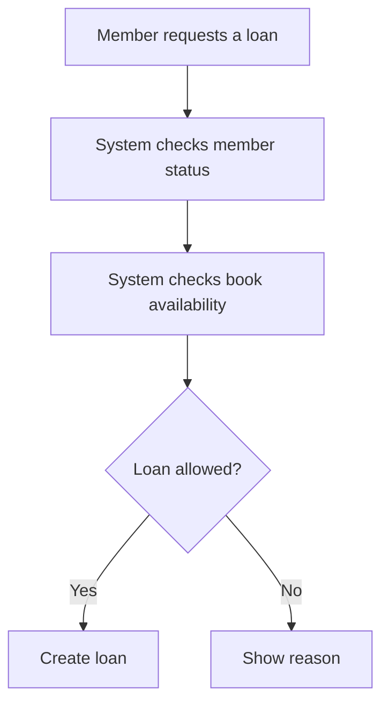

# Get Started: AI for Analysts

This guide helps you set up your computer for the AI for Analysts project. No coding experience is needed.

The main goal is **analysis**, not programming. You will use **Visual Studio Code** as your workspace, use an AI assistant such as **Codex**, **Claude Code**, or **Kilo Code**, and create your own analysis outputs from the real project materials.

You will use the project as evidence:

- The `analysis/raw-materials` folder contains source material such as data files, notes, interviews, and service documentation.
- The `backend` and `frontend` folders contain the real codebase.
- The codebase helps you understand what the system currently does.
- Your own files under `analysis` will contain your models, findings, epics, and user stories.

Running the application locally is useful, but it is optional. The most important work is reading, analyzing, modelling, and writing clear requirements based on evidence.

When this guide asks you to run something in the terminal, the command will appear in a separate box like this:

```powershell
example command goes here
```

Copy or type only the text inside the box, then press **Enter**.

---

## Part 1: Required Setup for Analysis

This part gives you everything you need to work in Visual Studio Code, inspect the existing project, use AI, and create analysis artifacts.

---

## Step 1: Install Visual Studio Code

Visual Studio Code, also called VS Code, is the main tool for this course.

You will use VS Code to:

- Open the project folder
- Read raw materials
- Inspect the existing codebase
- Chat with an AI assistant
- Write Markdown analysis documents
- Create Mermaid diagrams
- Create BPMN and DMN models
- Store epics and user stories under the `analysis` folder

### Install VS Code

1. Go to [https://code.visualstudio.com](https://code.visualstudio.com)
2. Click the **Download** button
3. Choose your operating system: Windows, Mac, or Linux
4. Run the installer and follow the steps
5. Launch VS Code when done

---

## Step 2: Open the Project in VS Code

Now open the project folder.

### Open the folder

1. Open VS Code
2. Click **File** -> **Open Folder**
3. Navigate to where you saved the project
4. Select the main project folder
5. Click **Select Folder**

### Check that you opened the correct folder

Look at the Explorer panel on the left. You should see folders like:

- `analysis`
- `backend`
- `frontend`

If you do not see these folders, you probably opened the wrong folder. Use **File** -> **Open Folder** again and select the folder that contains `analysis`, `backend`, and `frontend`.

---

## Step 3: Install VS Code Extensions for Analysis

Extensions add useful features to VS Code. These extensions help you read code, write analysis documents, preview diagrams, and create formal process and decision models.

### Essential extensions

1. **Markdown Preview Enhanced** by Yiyi Wang
   - Preview Markdown analysis documents nicely
   - Useful for `.md` files under `analysis`
   - [Install here](https://marketplace.visualstudio.com/items?itemName=shd101wyy.markdown-preview-enhanced)

2. **Mermaid Diagram Syntax** by Jhammond
   - Helps you write Mermaid diagrams in Markdown
   - Useful for quick process flows, system sketches, and relationship diagrams
   - [Install here](https://marketplace.visualstudio.com/items?itemName=jhammond.vscode-mermaid-syntax)

3. **Camunda Modeler** by Miragon
   - Create and edit BPMN and DMN models inside VS Code
   - Useful for formal process models and decision tables
   - [Install here](https://marketplace.visualstudio.com/items?itemName=miragon-gmbh.vs-code-bpmn-modeler)

### Recommended code-reading extensions

4. **Python** by Microsoft
   - Helps VS Code understand the backend code
   - [Install here](https://marketplace.visualstudio.com/items?itemName=ms-python.python)

5. **Pylance** by Microsoft
   - Helps with Python navigation, code understanding, and error checking
   - [Install here](https://marketplace.visualstudio.com/items?itemName=ms-python.vscode-pylance)

### How to install an extension

1. Open VS Code
2. Press `Ctrl + Shift + X`, or click the Extensions icon on the left sidebar
3. Search for the extension name, for example `Markdown Preview Enhanced`
4. Click **Install**
5. Wait for it to finish
6. Repeat for the other extensions

---

## Step 4: Set Up an AI Assistant

You will use an AI assistant to help you inspect the codebase, summarize raw materials, challenge your thinking, and draft analysis artifacts.

You only need one AI assistant. Use the one your instructor or organization has provided access to.

Choose one of these options:

- **Codex**
- **Claude Code**
- **Kilo Code**

---

## Option A: Set Up Codex

Codex runs from the terminal and works with the files in your project folder.

### Install Codex

First make sure Node.js is installed. If you do not have Node.js yet, install the LTS version from [https://nodejs.org](https://nodejs.org).

Then open the VS Code terminal:

1. In VS Code, click **Terminal** -> **New Terminal**
2. Make sure the terminal opens in the main project folder
3. Run:

```powershell
npm install -g @openai/codex
```

### Sign in

```powershell
codex --login
```

### Start Codex

```powershell
codex
```

### First useful prompt

```text
Explain this project structure. Help me inspect the code and raw materials so I can start an analysis.
```

---

## Option B: Set Up Claude Code

Claude Code runs from the terminal and works with the files in your project folder.

### Install Claude Code

First make sure Node.js is installed. If you do not have Node.js yet, install the LTS version from [https://nodejs.org](https://nodejs.org).

Then open the VS Code terminal:

1. In VS Code, click **Terminal** -> **New Terminal**
2. Make sure the terminal opens in the main project folder
3. Run:

```powershell
npm install -g @anthropic-ai/claude-code
```

### Check that Claude Code installed correctly

```powershell
claude --version
```

### Start Claude Code

```powershell
claude
```

Follow the sign-in steps in the browser if Claude Code asks you to log in.

### First useful prompt

```text
Explain this project structure. Help me inspect the code and raw materials so I can start an analysis.
```

---

## Option C: Set Up Kilo Code

Kilo Code is an AI assistant that runs inside VS Code as an extension.

### Install Kilo Code in VS Code

1. Open VS Code
2. Press `Ctrl + Shift + X`, or click the Extensions icon on the left sidebar
3. Search for `Kilo Code`
4. Click the dropdown arrow next to **Install**
5. Select **Install Pre-Release Version**
6. Follow the sign-in or setup steps shown by Kilo Code

Kilo Code's documentation says the current VS Code extension is distributed through the pre-release channel in the VS Code Marketplace.

### First useful prompt

```text
Explain this project structure. Help me inspect the code and raw materials so I can start an analysis.
```

---

## Step 5: Understand the Project as Analysis Material

You are not starting from an empty folder. The project already contains materials you can analyze.

### Main folders

```text
AI_for_analysts_project/
|-- analysis/                  Your analysis work goes here
|   `-- raw-materials/         Source material provided with the project
|
|-- backend/                   Existing Python backend code
|   |-- app/                   Backend application code
|   `-- tests/                 Tests that describe expected behavior
|
`-- frontend/                  Existing frontend code
    `-- src/                   User interface code
```

Some analysis folders may not exist yet. Create them yourself when you need them.

Suggested structure:

```text
analysis/
|-- raw-materials/             Provided source material
|-- as-is/                     Your current-state analysis
|-- requirements-analysis/     Your findings, epics, and stories
`-- models/                    Your Mermaid, BPMN, and DMN models
```

---

## Step 6: Start the Analysis

Your analysis should be based on evidence from:

- Raw materials
- Existing code
- Existing tests
- The running application, if you choose to run it
- Your own reasoning
- AI-assisted summaries that you verify yourself

### 1. Inspect the raw materials

Start in:

```text
analysis/raw-materials
```

Look for:

- Stakeholder needs
- Complaints or pain points
- Business terms
- Business rules
- Data definitions
- Process steps
- Decisions
- Open questions

Useful AI prompts:

```text
Review the files in analysis/raw-materials and list the main business problems mentioned.
```

```text
Extract stakeholder needs, pain points, business rules, and open questions from the raw materials.
```

```text
Create a first summary of the current business process based only on the raw materials. Mention uncertainty where evidence is weak.
```

### 2. Inspect the codebase as context

Use the codebase to understand what the current system actually supports.

Useful places to inspect:

- `backend/app/domain`
- `backend/app/services`
- `backend/app/routers`
- `backend/tests`
- `frontend/src`

Useful AI prompts:

```text
Explain the backend domain model in business language. Avoid technical jargon where possible.
```

```text
Read the loan-related services and tests. What business rules are implemented?
```

```text
Compare the raw materials with the current code. Which needs are implemented, partly implemented, or missing?
```

### 3. Create analysis documents

Create Markdown files under the `analysis` folder.

Suggested files:

```text
analysis/as-is/system-overview.md
analysis/as-is/process-observations.md
analysis/requirements-analysis/findings.md
analysis/requirements-analysis/open-questions.md
analysis/requirements-analysis/epics-and-stories.md
```

Good analysis documents include:

- What you observed
- Where the evidence came from
- What the current system appears to do
- What stakeholders seem to need
- What is unclear
- What should be improved

Use Markdown headings to keep your work readable:

```markdown
# System Overview

## Evidence Reviewed

## Current Behavior

## Business Rules

## Pain Points

## Open Questions
```

### 4. Create Mermaid diagrams

Mermaid diagrams are useful for quick visual models inside Markdown files.

Example:



You can store Mermaid diagrams inside Markdown files such as:

```text
analysis/as-is/process-observations.md
```

### 5. Create BPMN and DMN models

Use **Camunda Modeler** when you need more formal models.

Suggested model files:

```text
analysis/models/library-loan-process.bpmn
analysis/models/loan-eligibility.dmn
```

Use BPMN for:

- Process flows
- Handoffs
- Events
- Tasks
- Exceptions

Use DMN for:

- Decision tables
- Eligibility rules
- Policy logic
- Business rules with conditions and outcomes

### 6. Create epics and user stories

Store epics and user stories as Markdown under:

```text
analysis/requirements-analysis/epics-and-stories.md
```

Use a structure like this:

```text
Epic: Improve the loan request process

User story:
As a library member,
I want to understand whether I am eligible to borrow a book,
so that I know why my loan request is accepted or rejected.

Acceptance criteria:
- Given ...
- When ...
- Then ...

Evidence:
- Raw material: ...
- Code/test reference: ...
- App observation, if available: ...

Open questions:
- ...
```

Useful AI prompt:

```text
Based on the raw materials and existing code, draft epics and user stories. Include evidence, assumptions, and open questions for each story.
```

---

## Part 2: Optional Setup to Run the Application

Running the application is helpful because you can see the system behavior in a browser. It is not required for the first analysis work.

Use this part if you want to run the backend and frontend locally.

---

## Optional Step 1: Install Python

Python is needed to run the backend.

### Install Python

1. Go to [https://www.python.org/downloads](https://www.python.org/downloads)
2. Click the **Download Python** button
3. Download version 3.11 or higher
4. Run the installer
5. On Windows, check the box that says **Add Python to PATH** before clicking Install
6. Click **Install Now**
7. Wait for it to finish, then close the installer

### Verify Python is installed

Open a terminal and run:

```powershell
python --version
```

You should see something like:

```text
Python 3.11.4
```

---

## Optional Step 2: Install Node.js

Node.js is needed to run the frontend. It is also needed if you use Codex or Claude Code from the terminal.

### Install Node.js

1. Go to [https://nodejs.org](https://nodejs.org)
2. Click the **LTS** button
3. Run the installer and follow the steps
4. Launch a new terminal after installation

### Verify Node.js is installed

```powershell
node --version
```

You should see something like:

```text
v20.11.0
```

Then check npm:

```powershell
npm --version
```

You should see a version number.

---

## Optional Step 3: Set Up the Backend

Open a VS Code terminal from the main project folder.

Check that you are in the correct folder:

```powershell
dir
```

You should see:

- `analysis`
- `backend`
- `frontend`

### Create a Python environment

```powershell
python -m venv .venv
```

Wait for the command to finish. This can take a minute.

### Activate the environment

On Windows:

```powershell
.venv\Scripts\activate
```

On Mac/Linux:

```bash
source .venv/bin/activate
```

You should see `(.venv)` at the start of the terminal line.

### Install backend packages

```powershell
pip install -r backend/requirements.txt
```

Wait for the command to finish.

---

## Optional Step 4: Start the Backend

In the VS Code terminal, run these commands one by one:

```powershell
.venv\Scripts\activate
```

```powershell
cd backend
```

```powershell
uvicorn app.main:app --port 8000 --app-dir .
```

You should see output like:

```text
INFO:     Uvicorn running on http://127.0.0.1:8000
```

Leave this terminal running.

### Test the backend

1. Open a web browser
2. Go to `http://127.0.0.1:8000`
3. You should see:

```json
{"message":"Library AI for Analysts backend is running."}
```

---

## Optional Step 5: Start the Frontend

Open a second VS Code terminal. Keep the backend running in the first terminal.

In the second terminal, run:

```powershell
cd frontend
```

Copy the frontend settings template.

On Windows:

```powershell
copy .env.example .env
```

On Mac/Linux:

```bash
cp .env.example .env
```

Install the frontend packages:

```powershell
npm install
```

Start the frontend:

```powershell
npm run dev
```

You should see output like:

```text
VITE v5.4.0  ready in 123 ms
Local:   http://localhost:5173/
```

### Test the frontend

1. Open a web browser
2. Go to `http://localhost:5173`
3. You should see a page titled **AI for Analysts**
4. Click the **Check backend health** button
5. You should see **Backend status: ok**

---

## Optional Troubleshooting

### Backend will not start?

Make sure you activated the environment:

```powershell
.venv\Scripts\activate
```

Make sure you are in the `backend` folder:

```powershell
cd backend
```

Check if port 8000 is already in use:

```powershell
netstat -ano | findstr :8000
```

### Frontend will not start?

Make sure npm is installed:

```powershell
npm --version
```

Make sure you are in the `frontend` folder:

```powershell
cd frontend
```

Install the frontend packages again:

```powershell
npm install
```

### Python not found?

- Reinstall Python and check **Add Python to PATH**
- Restart VS Code after installing Python

### Port 8000 already in use?

Find what is using it:

```powershell
netstat -ano | findstr :8000
```

Or use a different port:

```powershell
uvicorn app.main:app --port 8001 --app-dir .
```

If you use a different backend port, also update `frontend\.env`:

```text
VITE_BACKEND_URL=http://127.0.0.1:8001
```

Then restart the frontend with `npm run dev`.

---

## What Good Work Looks Like

By the end of the analysis work, you should have created files under `analysis` such as:

- Current-state notes
- Mermaid diagrams
- BPMN process models
- DMN decision models
- Findings
- Open questions
- Epics
- User stories

Your work should clearly show:

- Which evidence you used
- What the current system does
- What stakeholders need
- What is missing or unclear
- Which requirements should be considered next

The AI assistant can help you move faster, but your conclusions should always be checked against the actual raw materials and codebase.
